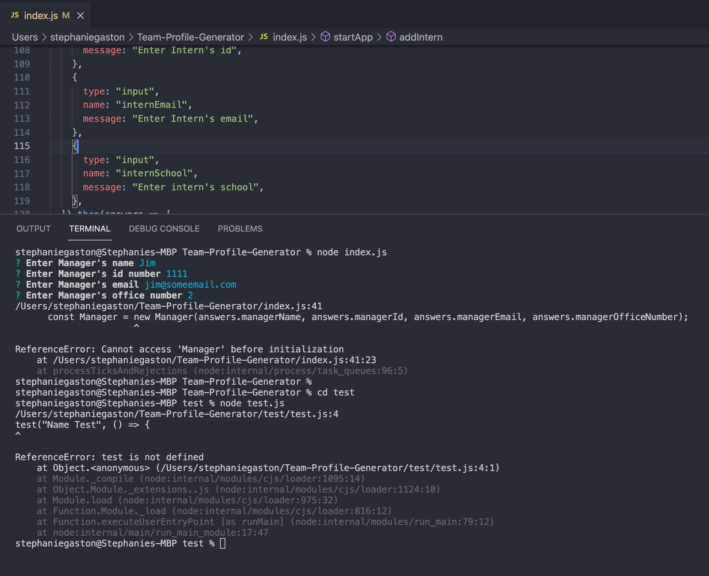
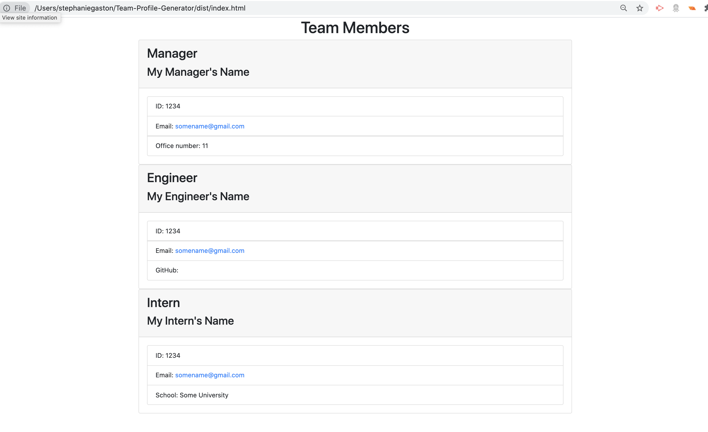

# Team-Profile-Generator

A Node.js command-line application that takes in information about employees on a software engineering team, then generates an HTML webpage that displays summaries for each person.

## Goal:

The goal was to create a command-line application and write unit tests to ensure that the code would be easily maintainable in the future. The testing was to be done for every part of the code to ensure accuracy.

## Issues:

- Testing needs to be re-visited. When running the tests I was given an error that I need to research more.

## Results:

I am able to answer some prompts. I was able to design a clean html page. Package.json is set up correctly and the file organization mainly follows the guidelines outlined in the assignment's README.md file.

## Finished Team Generator Video:

https://drive.google.com/file/d/1MRWIxeRwNG10vOhdEedpbBxDVyn7dxKY/view?usp=sharing

### Github Link:

https://sbgastondesign.github.io/Team-Profile-Generator/

## Future Updates:

- Resolve website data population issue.
- Review application testing and fix errors.

### License

MIT License, Copyright (c) [2021] [StephanieGaston]

---

### Contact:

- Email: sbgastondesign@gmail.com
- Github: github.com/sbgastondesign
- LinkedIn: "http://www.linkedin.com/stephanie-gaston-1067217a/"
